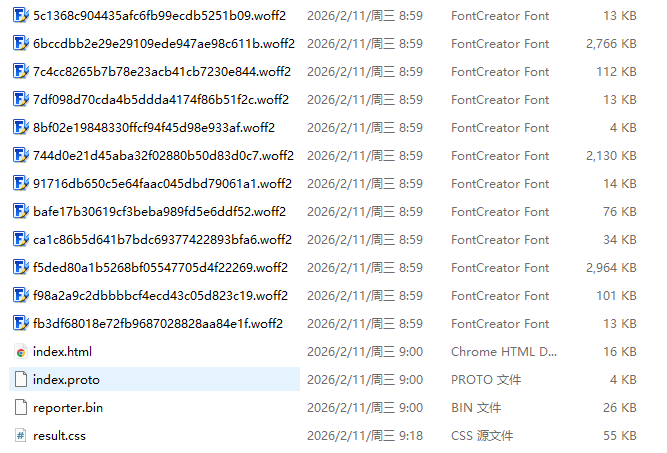
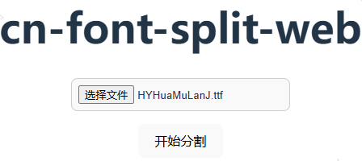

方便快捷地进行字体文件分割

一、项目启动

npm安装依赖包 npm install

启动项目 npm run dev

二、浏览器设置

浏览器设置下载文件位置，关闭询问

三、生成结果

分割字体文件，result.css中定义了所有字体的关联，引入到项目中

四、开始分割

启动项目开始分割，需要允许浏览器连续下载多个文件，如果提示是否等待则点击等待

五、参数配置

https://github.com/KonghaYao/cn-font-split/tree/release/packages/ffi-js

fontSplit({
input: inputBuffer, // 输入的字体缓冲区
outDir: './dist/font', // 输出目录

    // subsets: [                // 手动分包范围，一般而言不需要手动配置
    //   [65,66,67],             // 第一个分包，对照: 65(A)、66(B)、67(C)
    //   [102,103,104],          // 第二个分包，对照: 102(f)、103(g)、104(h)
    // ],

    // css: {                        // CSS 输出产物配置，一般而言不需要手动配置
    //  fontFamily: 'Test Sans',     // 输出 css 产物的 font-family 名称
    //  fontWeight: '400',           // 字重: 400 (常规)、700(粗体), 详细可见 https://developer.mozilla.org/en-US/docs/Web/CSS/font-weight
    //  fontStyle: 'normal',         // 字体样式: normal (常规)、italic (斜体)。可见 https://developer.mozilla.org/en-US/docs/Web/CSS/@font-face/font-style
    //  fontDisplay: 'swap',         // 字体显示策略，推荐 swap。可见 https://developer.mozilla.org/en-US/docs/Web/CSS/@font-face/font-display
    //  localFamily: ['Test Sans'],  // 本地字体族名称。可见 https://developer.mozilla.org/en-US/docs/Web/CSS/@font-face
    //  commentUnicodes: false,      // 在 CSS 中添加 Unicode 码点注释
    //  compress: true               // 压缩生成的 CSS 产物
    // },

    // languageAreas: false,       // 是否启用语言区域优化，将同一语言的字符分到一起
    // autoSubset: true,           // 当分包超过指定大小时是否自动拆分
    // fontFeature: true,          // 是否保留字体特性（如 Code 字体的连字、字距调整等）
    // reduceMins: true,           // 是否减少碎片分包，合并小分包以减少请求数，一般不需要修改

    previewImage: {
        name: 'preview', // 预览图片的文件名
        text: '中文网字计划\nThe Chinese Web Font Project', // 预览图片的文本内容
    },

    // chunkSize: 70 * 1024,           // 单个分片目标大小
    // chunkSizeTolerance: 1 * 1024,   // 分片容差，一般不需要修改
    // maxAllowSubsetsCount: 10,       // 最大允许分包数量，可能会和 chunkSize 冲突

    testHtml: true, // 是否生成测试 HTML 文件
    reporter: true, // 是否生成 reporter.bin 文件

    // 自定义分包输出的文件名为 6 位短哈希，或者使用自增索引: '[index].[ext]'
    renameOutputFont: '[hash:6].[ext]',
    // 不在控制台打印多余的日志信息
    silent: true,

});

好用给个 star 吧
